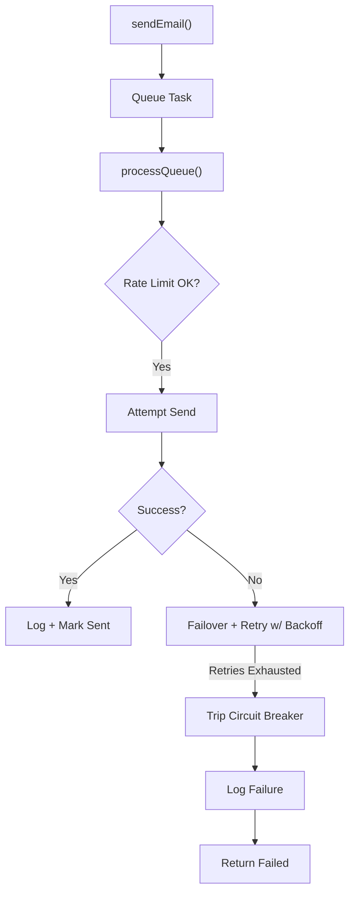

# 📧 EmailService

A **high-reliability**, **multi-provider** email delivery system designed with **circuit breaker support**, **idempotency**, **rate limiting**, and **exponential backoff retry** — all implemented as a pluggable micro-library in Node.js.

Built with production resilience in mind, it simulates the backend reliability required by systems like **iCloud Mail**, **Outlook**, or **Gmail** — ensuring email dispatches stay operational even under degraded conditions.

---

## 🔍 Overview

`EmailService` abstracts the complexity of provider failovers and reliability mechanisms to guarantee robust and traceable email delivery across distributed environments.

---

## ✨ Features

- ✅ **Multi-provider failover support**
- 🧠 **Idempotency control** for safe retries
- 🚦 **Rate limiting** with automatic resets
- 💥 **Circuit Breaker** pattern for failure isolation
- 🔁 **Exponential backoff retries** on transient failures
- 🗂️ **Queued delivery pipeline** for high throughput
- 🧪 **Battle-tested test suite with Jest**
- 📜 **Log persistence** to disk (`email.log`)

---

## 📁 Folder Structure

```
📦email-service/
 ┣ 📜emailService.js       # Core logic of EmailService
 ┣ 📜test.js               # Jest test suite for unit and integration scenarios
 ┗ 📜email.log             # Output log file (auto-created during execution)
```

---

## 🛠️ Installation

```bash
# Clone the repo
git clone https://github.com/AtHaRaVs/EmailService
cd email-service

# Install dependencies
npm install
```

---

## 🚀 Quick Start

```js
const EmailService = require("./emailService");

const emailService = new EmailService({
  circuitBreaker: {
    coolDown: 30000,
    threshold: 3,
  },
  backoffBase: 1000, // ms
});

const email = {
  to: "user@example.com",
  subject: "Welcome to our service!",
  body: "Thanks for signing up.",
};

emailService.sendEmail(email, "unique-idempotency-key").then(console.log);
```

---

## ⚙️ Configuration Options

| Option           | Description                                       | Default                             |
| ---------------- | ------------------------------------------------- | ----------------------------------- |
| `circuitBreaker` | Object controlling failure threshold and cooldown | `{ threshold: 3, coolDown: 30000 }` |
| `backoffBase`    | Milliseconds for exponential retry delay          | `1000`                              |
| `rateLimit`      | Emails per minute allowed                         | `10`                                |

---

## 🏗 Architecture

### Email Delivery Pipeline



### Resilience Mechanisms

- **Rate Limiter:** Max 10 emails/min (configurable)
- **Circuit Breaker:** Triggers after 3 consecutive failures
- **Retry Mechanism:** Exponential backoff across providers
- **Idempotency Layer:** Ensures deduplication on retries

---

## 🧪 Testing Strategy

The test suite (`test.js`) covers:

- ✅ Successful email sends
- 🔁 Idempotency handling
- 🔄 Provider failover
- 🚦 Rate limiting behavior
- 💥 Circuit breaker tripping and cooldown

### Run Tests

```bash
npm test
```

Tests are built using [Jest](https://jestjs.io) and include mocking of provider behaviors to simulate failure and success scenarios.

---

## 📊 Observability

All status changes are persisted in a log file `email.log` in the following format:

```text
[2025-07-11T09:00:00.123Z] {
  "trackingId": "email-...",
  "status": "sent",
  "provider": "ProviderA",
  "sentAt": 1623345343543
}
```

---

## 📈 Metrics & Insights

You can track delivery state via:

```js
// Check email delivery state
emailService.getStatus(trackingId);

// Check queue depth
emailService.getQueueLength();
```

---

## 📌 Design Decisions

- **Circuit Breaker** follows [Netflix Hystrix](https://github.com/Netflix/Hystrix)-inspired thresholds and cooldown model.
- **Exponential Backoff** used instead of constant retry to minimize impact on degraded systems.
- **Idempotency Cache** ensures safety across retries and network glitches.
- **Queue Processing Loop** decouples rate-limited delivery from direct `sendEmail` calls.
- **Logging to Disk** enables auditability and replay in case of failures.

---

## 🤝 Contribution Guide

We follow a strict testing and design-first contribution workflow.

1. Fork the repository.
2. Create a feature branch.
3. Add unit tests for new behavior.
4. Submit a PR with clear description.

---

## 👨‍💻 Author

**Kunwar Atharav Singh Kotwal** — Lead Engineer, Fault-Tolerant Systems

---

## ⚖️ License

[MIT License](./LICENSE)

---

> _"This service is hardened for scale. Think billions of transactions across continents. Treat it accordingly."_
